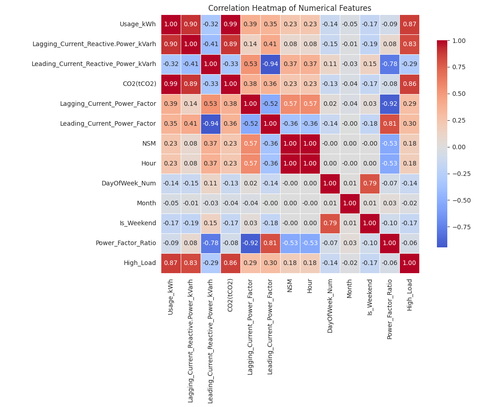
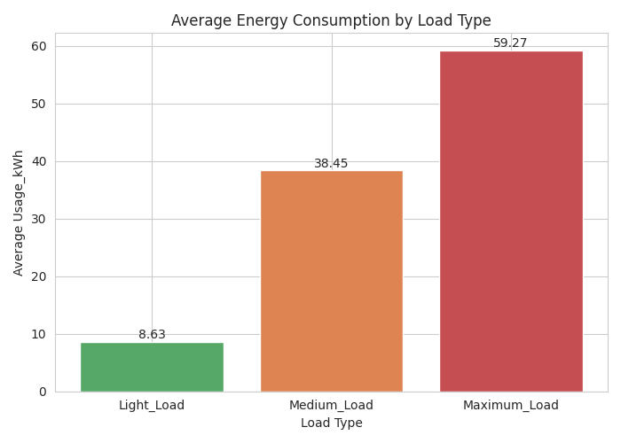
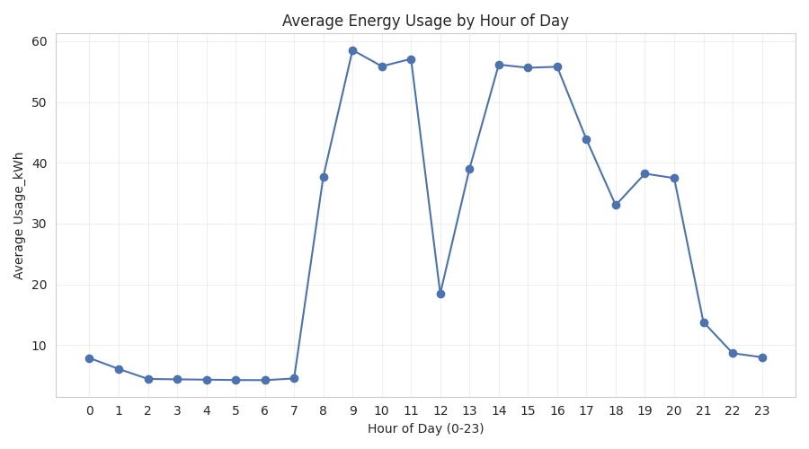
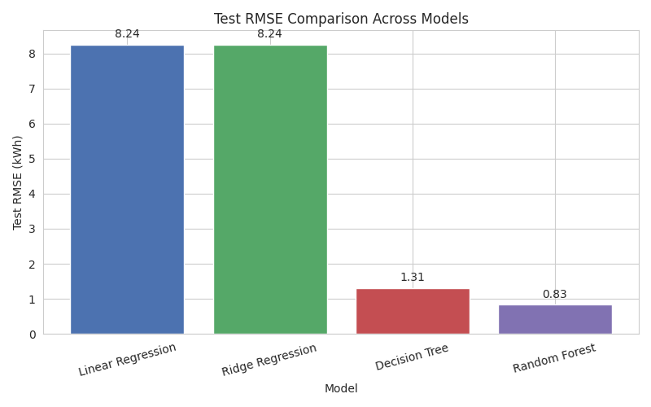
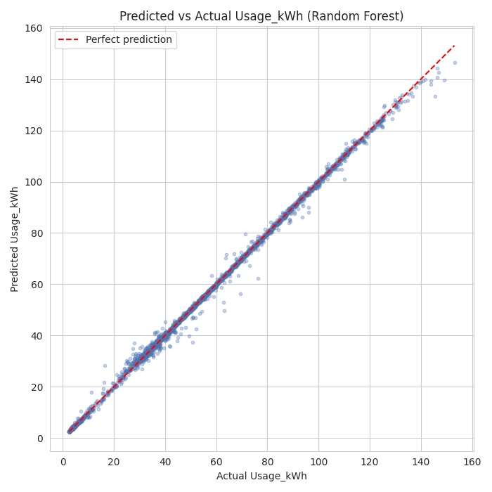
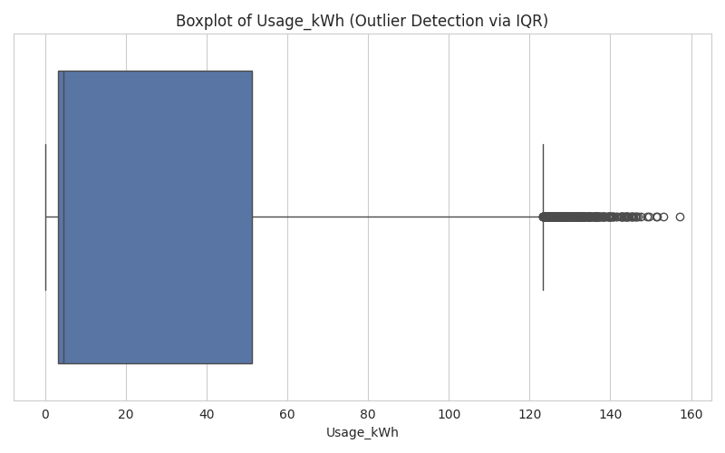

# Week 2 Internship Task — Deep EDA, Feature Engineering & Baseline Modeling

## Table of Contents
1. [Project Overview](#project-overview)
2. [Dataset Information](#dataset-information)
3. [Environment Setup](#environment-setup)
4. [Feature Engineering Steps](#feature-engineering-steps)
5. [EDA Findings](#eda-findings)
6. [Model Training Process](#model-training-process)
7. [Results and Conclusions](#results-and-conclusions)
8. [Screenshots of Important Outputs](#screenshots-of-important-outputs)
9. [Repository Structure](#repository-structure)

---

## Project Overview

This project analyzes real energy consumption data from a steel manufacturing
plant. It is split into two parts:

- **Part 1 — `week2_eda.ipynb`:** Deep exploratory data analysis and feature
  engineering. New time-based and ratio features are created, outliers are
  detected, and the key drivers of energy usage are identified through
  correlation analysis and visualizations.
- **Part 2 — `week2_baseline_models.ipynb`:** Baseline regression modeling.
  Four regression models are trained on the engineered dataset, evaluated
  with multiple metrics and 5-fold cross-validation, and compared to select
  a best-performing baseline model.

## Dataset Information

- **Name:** Steel Industry Energy Consumption Dataset
- **Source:** [UCI Machine Learning Repository](https://archive.ics.uci.edu/static/public/851/steel+industry+energy+consumption.zip)
- **Size:** 35,040 rows × 11 original columns (15-minute interval readings
  across the full year of 2018)
- **Original columns:**
  - `date` — timestamp of the reading
  - `Usage_kWh` — energy consumption (target variable)
  - `Lagging_Current_Reactive.Power_kVarh`, `Leading_Current_Reactive_Power_kVarh`
  - `CO2(tCO2)` — CO2 emissions
  - `Lagging_Current_Power_Factor`, `Leading_Current_Power_Factor`
  - `NSM` — number of seconds from midnight
  - `WeekStatus` — Weekday / Weekend
  - `Day_of_week` — Monday–Sunday
  - `Load_Type` — Light_Load / Medium_Load / Maximum_Load

## Environment Setup

```bash
# Clone the repository
git clone <your-repo-url>
cd <repo-folder>

# Create and activate a virtual environment (recommended)
python3 -m venv venv
source venv/bin/activate      # Windows: venv\Scripts\activate

# Install dependencies
pip install -r requirements.txt

# Launch Jupyter
jupyter notebook
```

Run `week2_eda.ipynb` first — it saves the engineered dataset that
`week2_baseline_models.ipynb` depends on.

## Feature Engineering Steps

1. **Datetime parsing:** `date` converted to datetime (the raw file mixes
   two text formats, both are parsed and combined so no rows are lost).
2. **Time features:** `Hour`, `DayOfWeek_Num`, `Month`, `Is_Weekend`
   extracted from `date`.
3. **`Power_Factor_Ratio`:** `Leading_Current_Power_Factor /
   Lagging_Current_Power_Factor`.
4. **`High_Load`:** binary flag, 1 if `Usage_kWh` is above the 75th
   percentile, else 0.

## EDA Findings



- **Data quality:** No missing values in the raw data, but the mixed date
  format needed careful parsing. One row produces a `NaN`
  `Power_Factor_Ratio` due to a zero denominator.
- **Outliers:** 328 rows (0.94%) flagged as outliers in `Usage_kWh` via the
  IQR method — these are genuine high-load operating periods, not data
  errors.
- **Top correlated features with `Usage_kWh`:** `CO2(tCO2)` (~0.99),
  `Lagging_Current_Reactive.Power_kVarh` (~0.90), `High_Load` (~0.87, by
  construction).




- Energy usage follows a strong daily rhythm: low overnight (~4–8 kWh),
  jumping sharply to 35–58 kWh during working hours (8 AM–9 PM), with a
  midday dip around noon.
- See the EDA Summary markdown cell at the end of `week2_eda.ipynb` for the
  full write-up, including the hypothesis on what drives energy spikes.

## Model Training Process

1. Loaded the engineered dataset from Part 1.
2. Dropped `date` (already decomposed into time features), `High_Load`, and
   `CO2(tCO2)` — the latter two leak the target since they are directly
   derived from / near-perfectly correlated with `Usage_kWh`.
3. One-hot encoded `Load_Type`, `WeekStatus`, `Day_of_week` (nominal
   categories with no natural order — see notebook for full rationale).
4. Split 80/20 train/test with `random_state=42`.
5. Trained **Linear Regression, Ridge Regression, Decision Tree Regressor,
   and Random Forest Regressor**.
6. Evaluated each with MAE, RMSE, R² on the test set, plus 5-fold
   cross-validated RMSE.

## Results and Conclusions



| Model | Test RMSE | Test R² | CV RMSE (mean ± std) |
|---|---|---|---|
| Linear Regression | 8.24 | 0.940 | 8.14 ± 0.09 |
| Ridge Regression | 8.24 | 0.940 | 8.14 ± 0.09 |
| Decision Tree | 1.31 | 0.998 | 1.41 ± 0.08 |
| **Random Forest** | **0.83** | **0.999** | **0.88 ± 0.07** |



**Random Forest Regressor** is the best-performing baseline: lowest test
RMSE, highest R², and CV RMSE close to test RMSE (no meaningful
overfitting). The linear models underfit — `Usage_kWh` depends on the
engineered features in a highly non-linear, step-like way that a linear
model can't capture. The single Decision Tree shows mild overfitting (CV
RMSE > test RMSE); Random Forest's averaging of many trees fixes this.

**Model carried forward:** Random Forest Regressor, as the baseline for any
future tuning or comparison against more advanced models.

## Screenshots of Important Outputs

All charts below are generated by the notebooks and saved automatically —
nothing here is hand-inserted.

| Output | Preview |
|---|---|
| Outlier boxplot (`Usage_kWh`, IQR method) |  |
| Correlation heatmap (all numerical features) |  |
| Average energy consumption by Load Type |  |
| Average energy usage by hour of day |  |
| Test RMSE comparison across all 4 models |  |
| Predicted vs Actual (best model: Random Forest) |  |

## Repository Structure

```
.
├── week2_eda.ipynb                 # Part 1: EDA & feature engineering
├── week2_baseline_models.ipynb     # Part 2: baseline regression modeling
├── data/
│   └── Steel_industry_data.csv     # Raw dataset
├── assets/                         # Chart screenshots used in this README
├── README.md
└── requirements.txt
```
